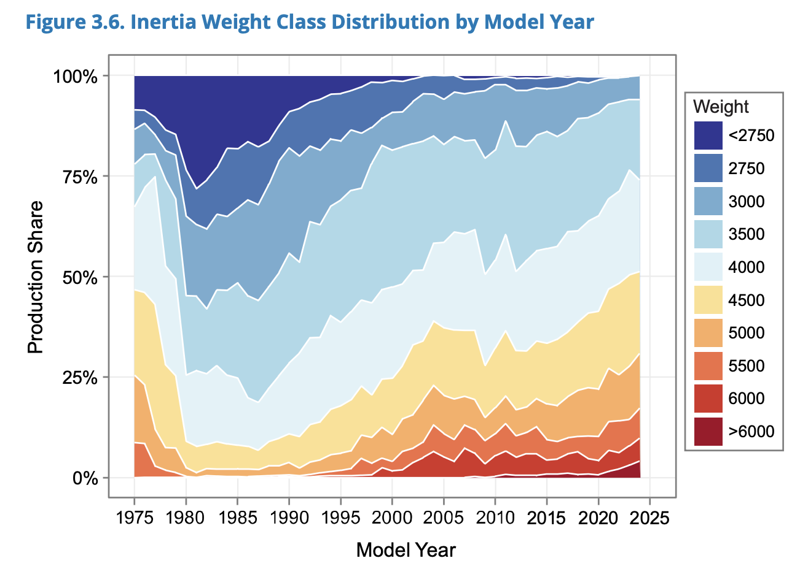

```{r setup, include=FALSE}
# Load required libraries
library(tibble)
library(dplyr)
library(tidyr)
library(purrr)
library(ggplot2)
library(kableExtra)
library(scales)
library(viridisLite)

# Set global options
knitr::opts_chunk$set(
  echo = FALSE,
  warning = FALSE,
  message = FALSE,
  fig.width = 10,
  fig.height = 6,
  fig.align = "center"
)

# Define color palette
colors <- list(
  primary = "#2E86AB",
  secondary = "#F24236", 
  accent = "#A23B72",
  light_blue = "#A8DADC",
  dark_gray = "#457B9D",
  green = "#2D5016"
)

# Set ggplot theme
theme_set(theme_minimal(base_size = 12) +
  theme(
    plot.title = element_text(color = colors$primary, size = 14, face = "bold"),
    plot.subtitle = element_text(color = colors$dark_gray, size = 11),
    axis.title = element_text(color = colors$dark_gray),
    legend.title = element_blank(),
    panel.grid.minor = element_blank(),
    panel.grid.major = element_line(color = "gray95", size = 0.5)
  ))

# Constants
TOTAL_VEHICLES <- 7783284
FLAT_FEE <- 151
```

# Executive Summary

Illinois currently charges a flat \$151 annual registration fee for all
passenger vehicles, regardless of weight. This analysis examines the
potential for implementing a **progressive weight-based fee structure**
similar to Washington D.C.'s successful 2023 program.

-   **Progressive Equity**: A weight-based fee structure would shift
    costs to higher-income households who typically own heavier
    vehicles, while a majority of Illinois vehicles (≤4,000 lbs) would
    see minimal or no fee increases.

-   **Substantial Revenue Potential**: Progressive fee schedules could
    generate an additional **\$500 million+ annually** beyond current
    registration revenue, providing dedicated funding for driving
    alternatives like mass transit, transportation safety and
    infrastructure improvements.

-   **Implementation Feasibility**: The system can be fully automated
    using existing VIN decoder databases, requiring no physical
    inspections or new hardware—following D.C.'s proven digital-first
    approach.

-   **Safety and Environmental Co-benefits**: By creating price signals
    that discourage oversized vehicles, the policy could reduce traffic
    fatalities (which increase 47% per additional 1,000 lbs of vehicle
    weight) and carbon emissions.

This analysis recommends a **moderate progressive schedule** that:

-   Maintains the current \$151 fee for vehicles ≤3,000 lbs

-   Gradually increases fees to \$600 for vehicles ≥7,000 lbs

-   Generates approximately **\$690 million in additional annual
    revenue**.

-   Revenue is primarily generated by higher-income households with larger vehicles

------------------------------------------------------------------------

# Motivation

Illinois roads carry ever-larger vehicles whose **mass and height raise
the stakes of every crash**. Over the last 30 years the average U.S.
passenger vehicle has gained roughly 8 inches in height and 1,000 lb in
curb weight
([IIHS](https://www.iihs.org/news/detail/vehicles-with-higher-more-vertical-front-ends-pose-greater-risk-to-pedestrians)),
while battery-electric models such as the GMC Hummer EV tip the scales
at about 9,000 lb—nearly twice the weight of a Honda Civic.

These extra pounds and inches aren't just cosmetic:

1.  **Crash lethality scales with size & mass** – A National Bureau of
    Economic Research
    [analysis](https://www.nada.org/nada/nada-headlines/american-cars-are-developing-serious-weight-problem-bloomberg)
    finds that each additional 1,000lb raises the odds a crash will kill
    someone **by 47%**.

2.  **Blunt, high hoods amplify pedestrian danger** – New
    [research](https://uhero.hawaii.edu/wp-content/uploads/2024/01/UHEROwp2401.pdf)
    matching detailed crash data to vehicle dimensions shows that every
    10 cm increase in front-end height ups pedestrian fatality risk **by
    22%**, and that reducing the size could spare **≈ 500 American lives
    per year**.

3.  **Heavier vehicles are polluting vehicles** – EPA's [Automotive
    Trends 2022
    report](https://www.epa.gov/system/files/documents/2022-12/420r22029.pdf)
    shows that a 5,500lb 2021-model car emits ≈ 40% more CO₂ per mile
    than a sub-3,000lb car. The IEA
    [calculates](https://www.iea.org/commentaries/suvs-are-setting-new-sales-records-each-year-and-so-are-their-emissions)
    that surging SUV sales (avg. curb weight ≈ 2t) drove **\>20%** of
    the global growth in energy-related CO₂ in 2023.

## Why a Weight-Based Registration Fee

Illinois already
[indexes](https://www.ilsos.gov/departments/vehicles/cft/fees.html) fees
for commercial and farm trucks to weight, but every passenger
vehicle—from a 2,700lb Honda Civic to a 9,000lb truck pays the same
**\$151** annual tag ([625 ILCS
5/3‑806](https://ilga.gov/legislation/ilcs/fulltext.asp?DocName=062500050K3-806)).

A sliding fee tied to curb weight should be considered for the following
reasons:

1.  **Internalize externalities** – motorists of heavier vehicles would
    pay more for the risk they pose for deadly crashes, increased carbon
    emissions, and road damage.

2.  **Nudge the market** toward lighter, lower-risk models (and
    lower-emission powertrains).

3.  **Fund safer alternatives** – revenue can be earmarked for transit,
    walking, and cycling projects that reduce dependence on over-sized
    cars.

4.  **It's a progressive tax** - Heavier vehicles are largely purchased
    by higher-income households. And because car-free households (who
    skew lower-income) pay nothing at all, the fee's effective burden
    rises with the ability to pay.

5.  **It's easy to administer** - Fee collection is fully digital: the
    DMV decodes each VIN, pulls the manufacturer's shipping weight from
    NHTSA's [VIN decoder database](https://vpic.nhtsa.dot.gov/decoder/),
    and assigns the bracket. No weigh‑ins or roadside stops required.

## Weight-based fees are not new

Over a dozen jurisdictions levy a progressive vehicle weight fee
([USDOT](https://www.fhwa.dot.gov/ohim/hwytaxes/mv103.pdf)). Washington
D.C. has the most aggressive schedule, which was recently implemented in
2023. Here are a few of those fee schedules:


```{r comparison-schedules, fig.width=8, fig.height=5, echo=FALSE}
# Helper function to create step coordinates for plotting
make_step <- function(state, lower, upper, fee) {
  tibble(state, lower, upper, fee) %>%
    mutate(
      weight = map2(lower, upper, ~c(.x, .y)),
      fee = map(fee, ~rep(.x, 2))
    ) %>% 
    unnest(c(weight, fee)) %>%
    select(state, weight, fee)
}

# Fee schedules for comparison
schedule_il <- tibble(
  state = "Illinois (current)",
  weight = c(0, 8000),
  fee = FLAT_FEE
)

schedule_dc <- make_step(
  "Washington D.C.",
  lower = c(0, 3500, 5000, 6000),
  upper = c(3499, 4999, 5999, 8000),
  fee = c(72, 175, 250, 500)
)

schedule_md <- make_step(
  "Maryland",
  lower = c(0, 3500, 3700),
  upper = c(3499, 3699, 8000),
  fee = c(120.5, 125.5, 191.5)
)

schedule_ia <- tibble(
  state = "Iowa",
  weight = seq(0, 8000, by = 500),
  fee = 0.004 * seq(0, 8000, by = 500)
)

## New York – full MV-202 table (already step-ready)
ny_upper <- c(
  1650,1750,1850,1950,2050,2150,2250,2350,2450,2550,
  2650,2750,2850,2950,3050,3150,3250,3350,3450,3550,
  3650,3750,3850,3950,4050,4150,4250,4350,4450,4550,
  4650,4750,4850,4950,5050,5150,5250,5350,5450,5550,
  5650,5750,5850,5950,6050,6150,6250,6350,6450,6550,
  6650,6750,6850,6950,6951          # "6 951 lb and over"
)

ny_fee2 <- c(
  26.0,27.5,29.0,31.0,32.5,34.0,35.5,37.5,39.0,40.5,
  42.0,43.5,45.5,47.0,48.5,50.0,52.0,53.5,55.0,56.5,
  59.0,61.5,64.0,66.5,69.0,71.0,73.5,76.0,78.5,81.0,
  83.5,85.5,88.0,90.5,93.0,95.5,98.0,100.5,102.5,105.0,
  107.5,110.0,112.5,115.0,117.0,119.5,122.0,124.5,127.0,129.5,
  131.5,134.0,136.5,139.0,140.0
) / 2                                    # annualise

ny_lower <- c(0, ny_upper[-length(ny_upper)] + 1)

schedule_ny <- tibble(
  state  = "New York",
  weight = c(rbind(ny_lower, ny_upper), 8000),
  fee    = c(rep(ny_fee2, each = 2), tail(ny_fee2, 1))
)

# Combine and plot
schedules_comparison <- bind_rows(schedule_il, schedule_dc, schedule_md, schedule_ia, schedule_ny)

# Create the plot with 5 colors for 5 states
ggplot(schedules_comparison, aes(weight, fee, color = state)) +
  geom_line(size = 1.2) +
  scale_x_continuous(labels = comma_format()) +
  scale_y_continuous(labels = dollar_format()) +
  labs(
    title = "Annual Registration Fee by Vehicle Weight",
    subtitle = "Comparison of existing weight-based fee structures",
    x = "Curb weight (lbs)",
    y = "Annual fee (USD)"
  ) +
  theme(
    legend.position = "bottom",
    plot.title = element_text(size = 16),      # Increase title size
    plot.subtitle = element_text(size = 14)    # Increase subtitle size
  )
```

# Case Study: How did Washington D.C. implement weight-based fees?


-   **2019** The first public draft of a weight-based registration fee
    appeared in the *Vision Zero Enhancement Omnibus Act* introduced by
    Councilmember Mary Cheh. Although the bill stalled, it seeded the
    concept that heavier cars should pay more because they pose outsized
    danger to people walking and biking.

-   **2021** D.C. DMV quietly tested the back-office plumbing with a
    one-year pilot that **knocked \$36 off** renewals for cars under
    3,500lb, proving that curb-weight look-ups and automated billing
    could be done entirely inside the existing online renewal portal (no
    weigh-ins, no new hardware).

-   **June 2022** The Council folded a refined **four-tier schedule**
    into the FY 2023 Budget Support Act. Annual fees now rise from
    **\$72** (\<3,500 lb) **to \$500** (≥6,000 lb), plus a parallel set
    of higher rates for commercial vehicles. ([Washington
    Post](https://www.washingtonpost.com/transportation/2022/06/25/dc-higher-vehicle-registration-fees/))

-   **Oct 2022 – Jan 2023** DMV phased-in the new charges at renewal:
    most owners saw the higher bill that October, while the ≥6,000lb
    tier took effect with the first 2023 registration cycle. An extra
    1,000lb "EV credit" was programmed to soften the hit on
    battery-electric models.

## How the program works

1.  **Automatic VIN decoding** - Owners renew online or at a kiosk; the
    DMV pulls the manufacturer's shipping weight from NHTSA's VIN
    database and assigns the bracket in real time—no scales, no
    paperwork.

2.  **Revenue & earmarks** - The Chief Financial Officer forecast
    **\$2.1 million** in the first partial year and **\$9 million per
    year once fully phased-in**. Council language directs the money to
    sidewalk, school-zone safety and Vision Zero projects, linking the
    fee to the harms it is meant to offset.

3.  **Equity guard-rails** - \<3,500lb cars (about 48% of the fleet) saw
    no increase; heavier-vehicle owners—who on average have higher
    incomes—pay the surcharge. Critics argued the jump from \$175 →
    \$250 in the mid-weight tier could sting working families, but the
    Council's fiscal note found the median increase city-wide was
    \$60/year ([DC DMV](https://dmv.dc.gov/node/155452)).

4.  **Complementary policies** - The fee joins a suite of "blunt but
    simple" price signals—graduated residential parking permits, higher
    ticket fines for repeat scofflaws, and automated speed-camera
    expansions—meant to push the city toward its Vision Zero and climate
    goals ([DC
    CFO](https://app.cfo.dc.gov/services/fiscal_impact/pdf/spring09/FIS%20FY%202023%20Budget%20Support%20Act%20of%202022%20Council%202nd%20Reading.pdf)).

## Early lessons

-   **Earmark visibly** - D.C. linked dollars from heavier vehicles
    directly to safety projects; polling shows that tying the fee to
    safer streets blunted opposition.
-   **Leverage existing data feeds** - Because NHTSA's VIN decoder is
    already public, Illinois SOS could replicate D.C.'s fully digital
    workflow with minimal IT lift.


# What could a weight-based fee look like in Illinois?

Illinois had **7,783,284** active passenger vehicle registrations as of
May 30th 2025
([ILSOS](https://www.ilsos.gov/departments/vehicles/statistics/activereg/2025/activereg053025.pdf)),
and all internal combustion vehicles pay a flat \$151 tag. To see what a
progressive schedule might raise, we need two things: (1) today's fleet
weight mix and (2) a set of possible fee tables.

## Fleet-weight distribution

EPA's 2024 *Automotive Trends*
[report](https://climateprogramportal.org/wp-content/uploads/2025/02/The-2024-EPA-Automotive-Trends-Report.pdf)
publishes production shares by inertia-weight class (≈ curb-weight +
300lb). Vehicles have become significantly heavier over the past 20
years.

```{r fig.align='center', out.width="561px", echo=FALSE}

```

We treat the MY-2023 distribution as a reasonable proxy for the on-road
fleet and collapse it into six 1,000-lb-wide bins. Keep in mind, this is
an estimate that will not match the actual distribution in Illinois. The
Illinois Secretary of State has access to VINs, which would allow the
office to make a precise distribution.

```{r fleet-distribution, echo=FALSE}
# Fleet weight distribution based on EPA data
fleet_data <- tibble(
  weight_bin = c("≤ 3,000 lb", "3,001–3,999", "4,000–4,999", 
                 "5,000–5,999", "6,000–6,999", "7,000–10,000"),
  lower_bound = c(0, 3001, 4000, 5000, 6000, 7000),
  upper_bound = c(3000, 3999, 4999, 5999, 6999, 10000),
  share = c(0.25, 0.30, 0.25, 0.12, 0.05, 0.03),
  vehicles = round(share * TOTAL_VEHICLES)
)

# Create formatted table
fleet_data %>%
  select(weight_bin, vehicles, share) %>%
  mutate(
    vehicles = comma(vehicles),
    share = percent(share, accuracy = 1)
  ) %>%
  kable(
    col.names = c("Weight Range", "Estimated Vehicles", "Fleet Share"),
    caption = "Estimated Illinois Light-Duty Fleet Distribution by Weight",
    align = c("l", "r", "r")
  ) %>%
  kable_styling(
    bootstrap_options = c("striped", "hover", "condensed"),
    full_width = FALSE,
    position = "center",
    fixed_thead = TRUE
  ) %>%
  row_spec(0, bold = TRUE, color = "white", background = colors$primary) %>%
  column_spec(1, bold = TRUE, width = "3cm") %>%
  column_spec(2, width = "3cm") %>%
  column_spec(3, width = "2.5cm") %>%
  footnote(
    general = "Estimated using EPA 2024 Automotive Trends report production shares. Actual Illinois fleet distribution may vary. ILSOS may have shipping weight available for active registrations.",
    general_title = ""
  )
```


## Modeling progressive fee schedules

All scenarios maintain the statutory \$151 fee **up to 3,000 lb** and
implement progressive increases for heavier vehicles. We model two
approaches with different slopes:

```{r fee-schedules, echo=FALSE}
# Define fee schedules
schedule_flat <- tibble(
  weight_bin = fleet_data$weight_bin,
  fee = FLAT_FEE,
  scenario = "Current (Flat $151)"
)

schedule_moderate <- tibble(
  weight_bin = fleet_data$weight_bin,
  fee = c(151, 200, 250, 325, 450, 600),
  scenario = "Moderate Progressive"
)

schedule_steep <- tibble(
  weight_bin = fleet_data$weight_bin,
  fee = c(151, 225, 300, 400, 500, 600),
  scenario = "Steep Progressive"
)

all_schedules <- bind_rows(schedule_flat, schedule_moderate, schedule_steep)

# Create comparison table
schedule_comparison <- all_schedules %>%
  select(scenario, weight_bin, fee) %>%
  pivot_wider(names_from = scenario, values_from = fee) %>%
  mutate(
    `Moderate Increase` = `Moderate Progressive` - `Current (Flat $151)`,
    `Steep Increase` = `Steep Progressive` - `Current (Flat $151)`
  )

schedule_comparison %>%
  kable(
    col.names = c("Weight Range", "Current", "Moderate", "Steep", 
                  "Moderate Δ", "Steep Δ"),
    caption = "Proposed Progressive Fee Schedules for Illinois",
    format = "html",
    escape = FALSE,
    align = c("l", rep("r", 5))
  ) %>%
  kable_styling(
    bootstrap_options = c("striped", "hover", "condensed"),
    full_width = FALSE,
    position = "center"
  ) %>%
  row_spec(0, bold = TRUE, color = "white", background = colors$primary) %>%
  column_spec(1, bold = TRUE) %>%
  footnote(
    general = "All fees shown are annual amounts. Increases show additional cost above current $151 flat fee.",
    general_title = ""
  )
```


```{r schedule-visualization, fig.width=7, fig.height=5, echo=FALSE}
# Visualize the progressive schedules
all_schedules %>%
  filter(scenario != "Current (Flat $151)") %>%
  mutate(weight_bin = factor(weight_bin, levels = fleet_data$weight_bin)) %>%
  ggplot(aes(x = weight_bin, y = fee, color = scenario, group = scenario)) +
  geom_line(size = 1.5) +
  geom_point(size = 3) +
  scale_y_continuous(labels = dollar_format(), limits = c(100, 650)) +
  labs(
    title = "Progressive Weight-Based Registration Fee Proposals",
    subtitle = "Two alternative schedules for Illinois implementation",
    x = "Vehicle Weight Range",
    y = "Annual Registration Fee"
  ) +
  theme(
    axis.text.x = element_text(angle = 45, hjust = 1),
    legend.position = "bottom",
    plot.title = element_text(size = 16),      # Increase title size
    plot.subtitle = element_text(size = 14)    # Increase subtitle size
  )
```


## Revenue analysis

```{r revenue-calculations, echo=FALSE}
# Calculate revenue for each scenario
calculate_revenue <- function(fees, shares = fleet_data$share) {
  sum(fees * shares * TOTAL_VEHICLES)
}

revenue_results <- all_schedules %>%
  group_by(scenario) %>%
  summarise(
    annual_revenue = calculate_revenue(fee),
    .groups = "drop"
  ) %>%
  mutate(
    baseline_revenue = TOTAL_VEHICLES * FLAT_FEE,
    additional_revenue = annual_revenue - baseline_revenue,
    percent_increase = (additional_revenue / baseline_revenue) * 100
  )

# Create revenue summary table
revenue_results %>%
  mutate(
    annual_revenue = dollar(annual_revenue / 1e6, accuracy = 1, suffix = "M"),
    additional_revenue = case_when(
      additional_revenue == 0 ~ "$0",
      TRUE ~ dollar(additional_revenue / 1e6, accuracy = 1, suffix = "M")
    ),
    percent_increase = case_when(
      percent_increase == 0 ~ "0%",
      TRUE ~ paste0("+", round(percent_increase, 1), "%")
    )
  ) %>%
  select(-baseline_revenue) %>%
  kable(
    col.names = c("Fee Structure", "Total Annual Revenue", 
                  "Est. Additional Revenue", "% Increase"),
    caption = "Revenue Impact of Progressive Weight-Based Fees",
    align = c("l", "r", "r", "r")
  ) %>%
  kable_styling(
    bootstrap_options = c("striped", "hover", "condensed"),
    full_width = FALSE,
    position = "center"
  ) %>%
  row_spec(0, bold = TRUE, color = "white", background = colors$primary) %>%
  column_spec(1, bold = TRUE) %>%
  footnote(
    general = "
    Based on 7,783,284 registered passenger vehicles in Illinois as of May 2025.",
    general_title = "",
    footnote_as_chunk = TRUE
  )
```

## Progressive impact analysis

The weight-based fee structure creates a progressive tax system where
higher-income households—who typically own heavier vehicles—bear a
greater share of the burden:

```{r progressive-impact, echo=FALSE}
# Calculate impact by weight class
impact_analysis <- fleet_data %>%
  left_join(
    all_schedules %>% filter(scenario == "Moderate Progressive"),
    by = "weight_bin"
  ) %>%
  mutate(
    current_fee = FLAT_FEE,
    fee_increase = fee - current_fee,
    total_additional_revenue = fee_increase * vehicles,
    cumulative_vehicles = cumsum(vehicles),
    cumulative_share = cumulative_vehicles / TOTAL_VEHICLES
  )

# Create summary row
summary_row <- impact_analysis %>%
  summarise(
    weight_bin = "Total",
    vehicles = sum(vehicles),
    fee = NA,  # No single fee for total
    fee_increase = NA,  # No single increase for total
    total_additional_revenue = sum(total_additional_revenue)
  )

# Combine data with summary
table_data <- impact_analysis %>%
  select(weight_bin, vehicles, fee, fee_increase, total_additional_revenue) %>%
  bind_rows(summary_row) %>%
  mutate(
    vehicles = comma(vehicles),
    fee = case_when(
      is.na(fee) ~ "",
      TRUE ~ dollar(fee)
    ),
    fee_increase = case_when(
      is.na(fee_increase) ~ "",
      fee_increase == 0 ~ "$0",
      TRUE ~ paste0("+$", fee_increase)
    ),
    total_additional_revenue = case_when(
      total_additional_revenue == 0 ~ "$0",
      TRUE ~ dollar(total_additional_revenue / 1e6, accuracy = 0.1, suffix = "M")
    )
  )

# Get number of data rows (excluding total)
n_data_rows <- nrow(table_data) - 1

table_data %>%
  kable(
    col.names = c("Weight Range", "Vehicles", "New Fee", 
                  "Increase", "Est. Additional Revenue"),
    caption = "Progressive Impact: Moderate Fee Schedule",
    align = c("l", "r", "r", "r", "r")
  ) %>%
  kable_styling(
    bootstrap_options = c("striped", "hover", "condensed"),
    full_width = FALSE,
    position = "center"
  ) %>%
  row_spec(0, bold = TRUE, color = "white", background = colors$primary) %>%
  column_spec(1, bold = TRUE) %>%
  row_spec(1:2, background = colors$light_blue) %>%
  row_spec(n_data_rows + 1, bold = TRUE, background = "#f0f0f0") %>%  # Style the total row
  footnote(
    general = "Progressive Feature: Vehicles ≤ 4,000lbs see minimal increases",
    general_title = ""
  )
```


# Conclusion

The progressive nature of the fee structure creates a politically viable
path forward. A majority of vehicle owners likely see minimal increases,
and higher fees apply primarily to luxury vehicles. In order to be
politically viable, revenue should directly fund popular safety and
infrastructure improvements, and alternatives to driving like mass
transit.

------------------------------------------------------------------------

# Next Steps

-   This preliminary analysis is based on publicly-available data that
    is not as accurate as VIN data available to to the Illinois
    Secretary of State. That office should explore the potential revenue
    forecasts using their private data about VIN shipping weight from
    the NHTSA VIN Decoder database.

-   Automotive industry trade groups objected to this fee when it was
    introduced in Washington D.C. Their concerns should be heard and
    weighed against the status quo of damage caused by heavy large
    vehicles.

The path forward requires careful implementation to achieve the full
potential of weight-based vehicle registration fees in Illinois. With
proper execution, this policy can simultaneously advance equity, safety,
environmental, and fiscal objectives while providing a model for other
states to follow.
